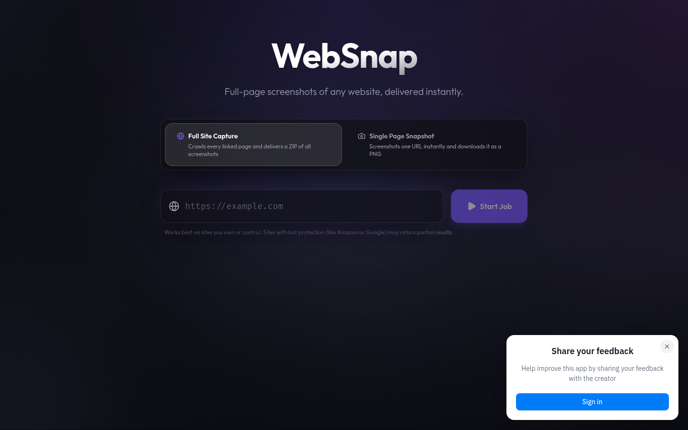
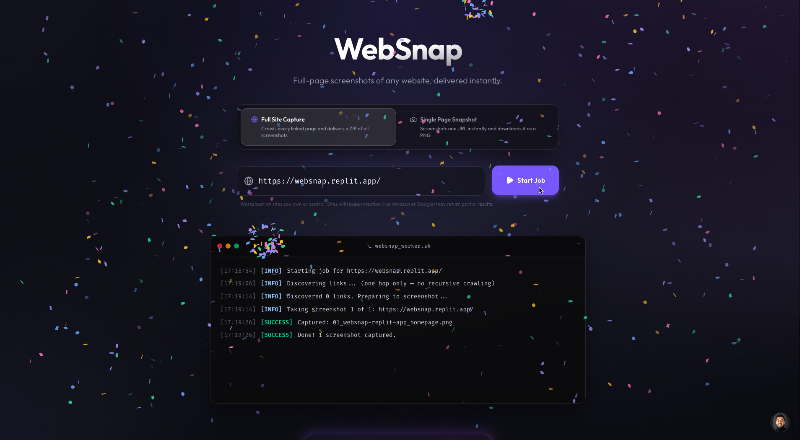

# WebSnap

A small desktop web app that turns any URL into full-page screenshots — either one PNG, or a ZIP of every page directly linked from the one you gave it.

## What it does

WebSnap has two modes. **Full Site Capture** takes a starting URL, finds every same-domain page linked from it, screenshots each one top to bottom, and bundles the results into a single ZIP file. **Single Page Snapshot** does what the name suggests: one URL in, one PNG out, no waiting around.

Jobs are capped at 50 URLs per crawl to keep runs predictable. WebSnap is built for a desktop browser; mobile screens are not supported.

## How it works

**Full Site Capture:** you submit a URL → WebSnap visits the page and discovers links to other pages on the same domain → it screenshots each page one at a time → the screenshots are zipped up → your browser downloads the ZIP.

**Single Page Snapshot:** you submit a URL → WebSnap takes a full-page screenshot → your browser downloads the PNG.




## Tech stack

- **Frontend:** React 19, Vite, TypeScript, Tailwind CSS, shadcn/ui
- **Backend:** Node.js, Express, TypeScript
- **Browser automation:** Playwright with `playwright-extra` and the `puppeteer-extra-plugin-stealth` plugin
- **Packaging:** `archiver` for building ZIPs on the fly
- **Monorepo:** pnpm workspaces
- **Other:** TanStack Query, Zod, OpenAPI codegen

## How to run it locally

You'll need Node.js 20+ installed. Then:

```bash
# One-time only, if you don't already have pnpm
npm install -g pnpm
```

```bash
# Install dependencies and download the bundled Chromium browser automatically
pnpm install
```

```bash
# Boot the API server and the frontend together
pnpm start
```

Then open `http://localhost:5173` in your browser.

## Limitations

WebSnap works best on sites you own or control. Sites with serious bot protection — Amazon, Google, anything behind Cloudflare's harder challenges — may return partial or blank screenshots even with stealth mode enabled. Crawls are capped at 50 URLs to keep jobs finishing in a reasonable time and to avoid hammering anyone's server. One hop only: WebSnap follows links from the page you give it, but doesn't keep crawling from there.

## Built by

Built by Fenil Dedhia using Replit.
